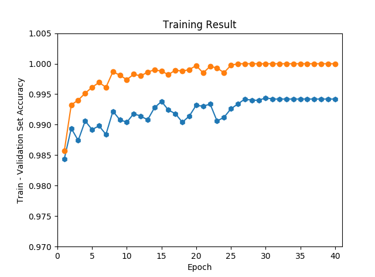

## LeNet Structure Used:
    
    1. Convolution 1: (5, 5, 32)
    2. Bacth normalization 1
    3. Max pool 1: kernel size (2, 2), stride (2, 2)
    4. Convolution 2: (5, 5, 64)
    5. Bacth normalization 2
    4. Max pool 2: kernel size (2, 2), stride (2, 2)
    5. Flatten: (3136,)
    6. FC 1: (3136 -> 1024)
    7. Drop out 1
    8. FC 2: (1024 -> 84)
    9. FC 3: (84 -> 10)

## Training Details:
    
    1. Learning rate: 0.001
    2. Drop out keep prob: 0.6
    3. Batch size: 128
    4. Number of epochs: 40

## Training Results:
    
    Test accuracy: 0.9945
    
